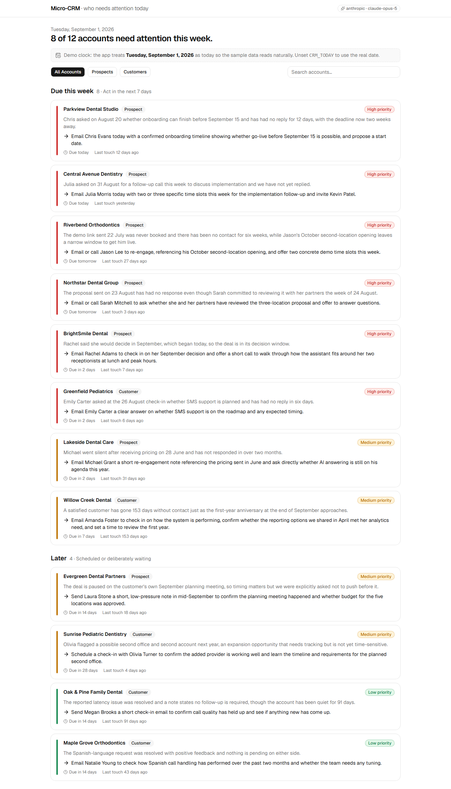
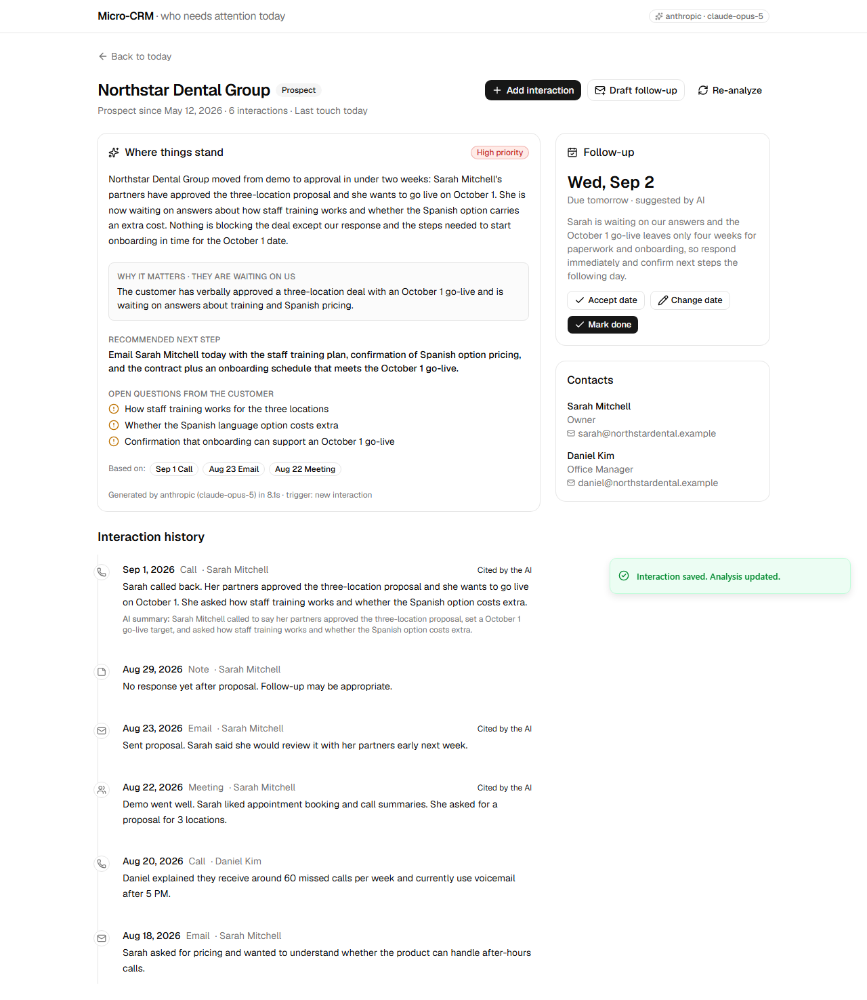

# AI-Powered Micro-CRM

> **"Tell me who needs attention today, why, and what to do next."**

A small CRM for a salesperson at a dental-technology company. It reads every account's
interaction history and turns it into a ranked daily to-do list: which prospects and customers
need attention, the reason, the concrete next step, and a suggested follow-up date. Every AI
statement links back to the raw notes it came from.



Built for the Practice by Numbers take-home assignment. Time spent: about six hours, using Claude
Code as a pair programmer.

## Run it in 60 seconds

**Option A: Docker (one container, no API key needed)**

```bash
docker compose up --build
# open http://localhost:8000
```

**Option B: local**

```bash
cp .env.example .env            # optional: add ANTHROPIC_API_KEY or OPENAI_API_KEY
make install                    # uv sync + npm install
make dev                        # API on :8000, UI on :5173
# open http://localhost:5173
```

Requirements for option B: Python 3.12 with [uv](https://docs.astral.sh/uv/), Node 20 or newer.

Without an API key the app still runs: the 12 sample accounts open with real Claude analyses that
ship in the repo, and new interactions are analysed by a transparent rule-based fallback (the UI
says so). With `ANTHROPIC_API_KEY` or `OPENAI_API_KEY` set, new interactions are analysed live.

Other commands: `make test` (backend tests), `make eval` (AI quality check), `make lint`,
`make seed-ai` (regenerate the committed analyses), `make help`.

## What I chose to build, and why

The brief lists four user needs. Each maps to one thing on screen:

| User need | What the product does |
| --- | --- |
| Keep track of relationships and interactions | Customer page with contacts and a raw timeline; "Add interaction" for emails, calls, meetings and notes |
| Understand who needs attention | Dashboard grouped into Overdue, Due this week, Later, Done; ranked by AI priority, with the reason on the card |
| Quickly understand context | AI relationship summary, one-line summaries for new interactions, open questions the customer is waiting on |
| Decide what to do next | Concrete next action naming the contact, suggested follow-up date with rationale, one-click email draft |

I deliberately built an **attention-first tool, not a database and not a chatbot**. The user
should not have to scan a table or type a question. They open the app and the first screen is
their day.

Two things I treated as non-negotiable:

- **Grounding.** Each analysis carries `evidence_ids`. The UI shows them as chips that highlight
  the exact interactions, and raw notes are never replaced by summaries. A salesperson will only
  act on a recommendation they can verify in two seconds.
- **Graceful degradation.** The AI proposes; the user accepts, changes or completes. If the model
  fails or no key is present, a rule-based provider steps in and is labelled as such.



## How it works

```
React + TypeScript + Tailwind + shadcn/ui        (frontend/)
        │  /api/*
FastAPI + SQLAlchemy + Pydantic  ── SQLite       (backend/app/)
        │
        ├── services/signals.py      facts computed in code (days since last touch, cues)
        ├── services/context.py      one JSON bundle per account (no retrieval system needed)
        └── services/ai/
              judgment.py            typed decisions: priority, waiting_on, urgency
              generation.py          words: summary, next action, date, email draft
              analyzer.py            judgment → generation → guardrails → save
              providers/             anthropic, openai, rules (fallback), jev (stub)
```

The flow when the user adds an interaction:

1. Save the raw note (never overwritten).
2. Build the account context: customer, contacts, ordered timeline, computed signals.
3. Judgment provider decides priority, who is waiting on whom, urgency.
4. Generation provider writes the relationship summary, interaction summary, reason, next action,
   follow-up date and open items, citing interaction ids.
5. Guardrails in code: clamp past dates, drop unknown evidence ids, cap lengths; on any failure,
   fall back to rules and flag it.
6. Store the analysis (append-only, with provider, model and latency) and return the customer.

AI runs only on write (new interaction, re-analyze, seed). Every page load is a plain database
read.

## Key decisions

Full reasoning, with alternatives, in [docs/DECISIONS.md](docs/DECISIONS.md). The short version:

- **Judgment and generation are separate protocols** so a typed-judgment model (TypeSafe's Jev)
  can own priority later without touching UI, API or storage. Today one Claude call implements
  both, so the split costs nothing.
- **Structured outputs with a plain model-facing schema** and strict domain models behind it.
- **Deterministic signals** are computed in code, fed to the model, and reused as guardrails.
- **Committed seed analyses** make first load instant and free, and freeze a baseline for the eval.
- **An eval script** checks the 12 accounts against expectations. See "AI quality" below.
- **SQLite, single user, synchronous analysis on save**: the simplest correct choices for a 4 to
  6 hour exercise, each with a documented production path.
- **A demo clock** (`CRM_TODAY=2026-09-01`) because the sample data ends on 31 August 2026 and
  "days since last touch" must make sense. The UI shows a banner when it is active.

## AI quality

`make eval` checks the committed analyses for all 12 sample accounts: expected priority, follow-up
date not in the past, evidence ids real, next action names a real contact, and account-specific
constraints (Evergreen must not be pushed before its September planning meeting). Current result
with `claude-opus-5`: **12 of 12 pass**; average latency about 7 seconds per account. Details and
the two expectations I changed after reading the model's reasoning are in
[docs/AI_DESIGN.md](docs/AI_DESIGN.md) and [docs/eval_results.md](docs/eval_results.md).

## Assumptions and simplifications

- **Who the user is.** The notes describe selling an AI phone-answering assistant to dental
  practices, so the prompt frames the seller that way. The framing is one sentence in `prompts.py`.
- **Single user, no auth.** One implicit user. Production path: an auth provider, `owner_id` on
  every table, per-request scoping.
- **Synchronous analysis.** Adding an interaction waits 5 to 12 seconds for the model (the UI shows
  an analysing state). Production path: a job queue and a status field on the analysis.
- **Interaction summaries only for new interactions.** The seed notes are already one sentence;
  summarising them would add cost without value.
- **A new interaction resets the follow-up schedule.** New information supersedes an old plan; the
  user can adjust again afterwards.
- **Drafts are copied, not sent.** No mail integration.
- **The CSVs were extracted from a PDF** and contain line breaks inside quoted notes; the importer
  normalises whitespace.
- **OpenAI default model** is `gpt-4.1`; override with `LLM_MODEL` if your account uses a
  different id. Anthropic default is `claude-opus-5`; `claude-sonnet-5` is faster and cheaper.

## What I would build next

1. **Zero-effort capture.** Ingest email threads and call recordings automatically so "minimal
   manual effort" becomes no manual effort. Practice by Numbers' own call summaries are the obvious
   source.
2. **Async analysis and notifications.** Job queue, "analysis pending" state, a morning digest of
   the Overdue and Due-this-week buckets.
3. **Feedback loop.** Record when users accept, change or ignore suggested dates and actions, and
   use it to tune prompts and the eval set.
4. **Jev for judgments.** Implement `providers/jev_typesafe.py`, compare its priority calls and
   confidence against the language model on the eval set, route low-confidence accounts to the
   LLM.
5. **Multi-user and Postgres.** Auth, `owner_id` scoping, `DATABASE_URL` switch, Alembic
   migrations.
6. **Analysis history in the UI.** The table already keeps every run; show how the AI's read
   changed over time.
7. **Cost controls.** Per-account token budgets, batch re-analysis overnight, model tiering.

## Repository map

```
README.md                    this file
***REMOVED_LINE***
***REMOVED_LINE***
docs/
  DECISIONS.md               product and technical decisions with alternatives
  AI_DESIGN.md               prompt, schema, guardrails, eval, extending with Jev
  CODE_TOUR.md               one line per source file
***REMOVED_LINE***
***REMOVED_LINE***
  eval_results.md            output of the last eval run
backend/                     FastAPI app, data, scripts, tests
frontend/                    React app
```

## API

| Method | Path | Purpose |
| --- | --- | --- |
| GET | `/api/health` | provider, model, demo date |
| GET | `/api/dashboard` | accounts grouped into buckets, ranked |
| GET | `/api/customers` | all accounts with latest analysis |
| GET | `/api/customers/{id}` | account, contacts, latest analysis, timeline |
| POST | `/api/customers/{id}/interactions` | save raw interaction, run analysis, return account |
| POST | `/api/customers/{id}/analyze` | re-run analysis |
| PATCH | `/api/customers/{id}/follow-up` | accept/change date, mark done or reopen |
| POST | `/api/customers/{id}/draft-message` | grounded email draft (not stored) |

Interactive docs at `http://localhost:8000/docs`.
